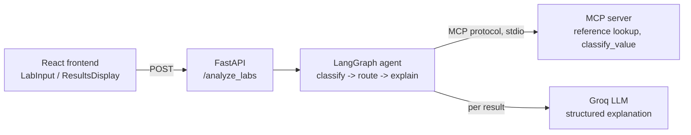

# Clinical Lab Results Analyzer

A full-stack tool for reviewing lab test results. Each result is compared
against a reference range, classified as Normal, Warning, or Critical, and
explained in plain language with suggested next steps — built around the
idea that a clinician should be able to see the reasoning behind a
classification, not just a colored label.

## How it works



The agent has three nodes:

- **classify** — for each lab result, calls the MCP server's
  `classify_value` tool (over the actual MCP protocol, not a plain function
  call) to compare the value against a reference range and assign a status.
  Handles missing values, unknown test names, and non-numeric results
  without crashing.
- **route** — groups results into critical / warning / normal / unresolved,
  critical first.
- **explain** — calls the LLM once per result, including Normal ones, to
  produce a short explanation and 1–3 next steps.

Reference ranges come from two places. If an input row already states its
own range (the Kaggle dataset does this via `Min_Reference`/`Max_Reference`
columns), the MCP tool uses that directly. Otherwise it falls back to a
hardcoded dictionary of common tests. A critical band is derived as 50% of
the normal range's width beyond each edge, so a value needs to be clearly
outside normal — not just marginally over — to be flagged Critical rather
than Warning.

Some lab tests aren't numeric — urine dipstick results like "Negatif" or
"1+". The classifier tries a numeric parse first, and only falls back to
qualitative interpretation (Normal/Negative → Normal, 1+ through 4+/Positive
→ Warning) if the value genuinely isn't a number.

## AI provider

Groq, via `langchain-groq`, using `openai/gpt-oss-20b`. Ollama is supported
as a local fallback with no API key required — switching providers is one
line in `.env` (`LLM_PROVIDER=ollama`), no code changes needed.

## Data source

Built to work with the Kaggle dataset *Laboratory Test Results – Anonymized
Dataset*. Tested against a 27-row export from that dataset, including
Turkish test names, dataset-provided reference ranges, and both qualitative
and numeric urine strip results. Result: 26 Normal, 1 Warning (a positive
erythrocyte strip test), 0 unresolved.

`/test_data` also contains three smaller synthetic CSVs
(`normal_results.csv`, `warning_results.csv`, `critical_results.csv`) for
exercising each severity tier without a Kaggle account.

## Setup

### Backend

```bash
cd backend
python -m venv .venv
.venv\Scripts\activate        # Windows
source .venv/bin/activate     # Mac/Linux
pip install -r requirements.txt
cp .env.example .env
```

Edit `.env`:

```
LLM_PROVIDER=groq
GROQ_API_KEY=your_key_here       # console.groq.com
GROQ_MODEL=openai/gpt-oss-20b
```

Run it:

```bash
uvicorn app.main:app --reload --port 8000
```

`http://localhost:8000/health` should return `{"status":"ok"}`.

### Frontend

```bash
cd frontend
npm install
cp .env.example .env    # VITE_API_BASE_URL=http://localhost:8000
npm run dev
```

Open the local URL Vite prints (usually `http://localhost:5173`).

### Using Ollama instead of Groq

```bash
ollama pull llama3.1
```

Set `LLM_PROVIDER=ollama` in `backend/.env`.

## Windows note

Spawning the MCP server as a subprocess requires the Proactor event loop,
which uvicorn doesn't reliably use on Windows, particularly with `--reload`.
`mcp_client.py` runs MCP calls on a dedicated background thread with its own
event loop to work around this, so no platform-specific setup is needed.

## Testing

1. Start both servers.
2. Upload a file from `/test_data`, or a CSV exported from the Kaggle
   dataset, via "Upload CSV".
3. Or use "Manual entry" for individual results.
4. Or call the API directly:

```bash
curl -X POST http://localhost:8000/analyze_labs \
  -H "Content-Type: application/json" \
  -d '{"labs": [{"test_name": "hemoglobin", "value": 6.5, "unit": "g/dL"}]}'
```

## Project structure

```
backend/app/
  main.py              FastAPI app, /analyze_labs endpoint
  agent.py             LangGraph agent (classify -> route -> explain)
  mcp_server.py        MCP server: reference_range_lookup, classify_value
  mcp_client.py         MCP client (background-thread loop, Windows-safe)
  reference_data.py      Hardcoded fallback reference ranges
  llm.py                  Groq / Ollama provider switch
  schemas.py                Pydantic request/response models
frontend/src/
  App.jsx
  api.js
  components/
    LabInput.jsx
    ResultsDisplay.jsx
    SeverityBadge.jsx
test_data/                  synthetic CSVs + a sample from the Kaggle dataset
```

## Known limitations

- The hardcoded reference-range dictionary covers common tests only.
  Anything outside it needs a dataset row that supplies its own
  `min_reference`/`max_reference`, or the result is routed to "unresolved."
- The MCP server is spawned fresh per request rather than kept as a
  long-lived session, which simplifies the implementation at some cost to
  latency.
- Qualitative strip-test interpretation only recognizes a fixed set of
  phrases (Normal/Negative/1+ through 4+/Positive). Anything outside that
  set is reported as unresolved rather than guessed at.